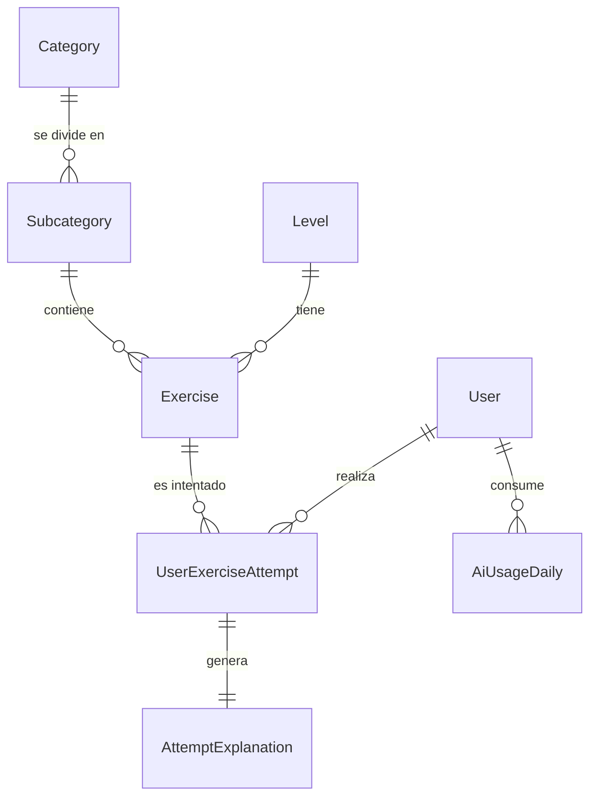

# QuickGram (Ceferly) 🇬🇧🚀

**QuickGram** (también conocido internamente como **Ceferly**) es una plataforma web interactiva diseñada para la preparación de exámenes oficiales de inglés, enfocada inicialmente en el nivel **B2 (Cambridge First Certificate - FCE)** con vistas a expandirse a niveles superiores como **C1 (Advanced - CAE)**. 

El proyecto combina la resolución de ejercicios prácticos oficiales (Grammar, Reading, Use of English y Writing) con **Inteligencia Artificial (IA)**, la cual actúa como un tutor personalizado que corrige las tareas abiertas (Essays) y proporciona explicaciones gramaticales detalladas en tiempo real de cada uno de los errores cometidos.

---

## 🛠️ Arquitectura y Tecnologías

El proyecto se estructura como una aplicación monorrepositorio dividida en dos partes:

### 1. Backend (`/backend`)
*   **Servidor**: Node.js con Express (v5.2.1) en formato ESM (ES Modules).
*   **Base de Datos y ORM**: MySQL gestionado a través de **Sequelize** (v6.37.7) con el driver `mysql2`.
*   **Inteligencia Artificial**: Integración con **OpenRouter API** (utilizando modelos de DeepSeek de forma gratuita, como `deepseek-r1`) o **Groq SDK** para generar explicaciones gramaticales personalizadas y calificar redacciones.
*   **Pasarela de Pago**: **Stripe** (v20.1.0) para la gestión de suscripciones de usuarios (`pro` y `premium`).
*   **Autenticación**: JSON Web Tokens (**JWT**) y **Google Auth Library** para login con cuentas de Google.
*   **Correos Electrónicos**: Integración con **Resend** para el envío de correos de recuperación de contraseña.

### 2. Frontend (`/frontend`)
*   **Framework**: **Angular 19** (v19.1.0) utilizando componentes autónomos (*Standalone Components*).
*   **Estilos**: CSS nativo y diseño responsivo, adaptado a una estética oscura de temática premium con colores verdes neón (`#2ecc71`).
*   **Animaciones**: **ngx-lottie** y **lottie-web** para animaciones interactivas e indicadores de racha/éxito.
*   **Pasarela de Pago**: `@stripe/stripe-js` (v8.6.0) para integrar las pantallas de pago de Stripe Checkout de forma transparente.

---

## 📁 Estructura de Base de Datos y Modelos

El modelo relacional de la base de datos MySQL está definido en `/backend/src/models/` y consta de las siguientes tablas:



### Detalle de las Tablas:
1.  **`users` (`User.js`)**: Almacena los datos del usuario, incluyendo el nombre, email, contraseña hasheada con `bcrypt`, racha de días de estudio (`streak`), última fecha en que completó su meta (`last_completed_date`), monedas (`coins`), semilla del avatar (`avatar_seed`), ID de Google para inicio rápido y estado de su suscripción de Stripe (`subscription_role` y `subscription_expires_at`).
2.  **`levels` (`Level.js`)**: Niveles de inglés del Marco Común Europeo (ej. `B2`, `C1`).
3.  **`categories` (`Category.js`)**: Categorías generales del idioma (ej. `Grammar`, `Vocabulary`, `Reading`, `Listening`, `Use of English`, `Writing`).
4.  **`subcategories` (`Subcategory.js`)**: Tipos de ejercicios específicos dentro de cada categoría (ej. `Conditionals`, `Word Formation`, `Essay`, `Gapped Text`).
5.  **`exercises` (`Exercise.js`)**: Contiene las preguntas, opciones de selección (para respuestas múltiples), el texto base (si aplica) y la estructura de respuestas correctas en formato JSON (`correct_answer`).
6.  **`user_exercise_attempts` (`UserExerciseAttempt.js`)**: Historial de intentos de ejercicios por parte de los usuarios. Almacena las respuestas proporcionadas, los aciertos, el total de huecos y la puntuación final.
7.  **`attempt_explanations` (`AttemptExplanation.js`)**: Almacena en caché las explicaciones generadas por la IA para un intento de ejercicio fallido, evitando re-consultar a la API externa si el usuario vuelve a ver sus resultados.
8.  **`ai_usage_daily` (`AiUsageDaily.js`)**: Lleva la cuenta de cuántas consultas a la IA realiza cada usuario al día para aplicar los límites del plan.

---

## 🚀 Funcionalidades Clave

### 1. Corrección Inteligente y Tutoría por IA
Cuando un usuario comete fallos en un ejercicio, puede solicitar una **explicación por IA**. 
*   El backend detecta el tipo de ejercicio (condicionales, vocabulario, opción múltiple, etc.) y genera un prompt dinámico para el modelo LLM.
*   El LLM responde en un formato JSON estricto estructurado en: `general_feedback` (comentario motivacional) y `corrections` (explicando para cada hueco incorrecto por qué está mal la respuesta del alumno y cuál es la regla gramatical correcta).
*   **Caché**: Si el intento ya tiene una explicación en `attempt_explanations`, se sirve al instante desde la base de datos sin consumir tokens de IA.

### 2. Gamificación
*   **Meta Diaria e Hilo de Racha (Streak)**: Los usuarios definen una meta diaria de intentos (por defecto, 5). Al cumplirla, la racha aumenta en 1. Si pasan un día entero sin cumplir la meta, el contador vuelve a 0.
*   **Monedas (`coins`)**: Se otorgan monedas al finalizar cualquier ejercicio. La cantidad varía según el plan de suscripción (`free`: +10, `pro`: +15, `premium`: +20).
*   **Tienda de Avatares**: Los usuarios pueden gastar 50 monedas en comprar un avatar único y aleatorio (generado visualmente mediante una semilla en base a su username o un string aleatorio en el cliente).

### 3. Clasificación Global (Rankings)
Permite a los usuarios competir de forma sana en dos categorías:
*   **Más Activos (Most Active)**: Ordenado por el número de ejercicios únicos completados.
*   **Mejor Promedio (Highest Average)**: Ordenado por la calificación media obtenida en todos sus intentos.

### 4. Pasarela de Pagos Stripe
Soporta dos planes de suscripción de pago mensual:
*   **Plan Pro (9.99€/mes)**: Acceso ilimitado a ejercicios y estadísticas avanzadas, además de aumentar el límite de IA a 15 consultas diarias.
*   **Plan Premium (19.99€/mes)**: Incluye todo lo anterior, hasta 40 consultas diarias de IA, tutorías y certificados.
*   **Flujo**: El backend crea una sesión de Stripe Checkout y devuelve la URL. Al realizarse el pago, Stripe redirige a `/success?session_id=...` en el frontend, el cual llama a `/api/payments/verify-session` en el backend para validar el pago y extender la suscripción por 30 días de forma segura.

---

## 💻 Análisis de las Vistas del Frontend

El enrutador de Angular (`app.routes.ts`) organiza la aplicación de la siguiente forma:

### Zona Pública / Autenticación
*   `✏️ /register` y `🔑 /login`: Formularios responsivos de registro e inicio de sesión tradicional y con Google Sign-In.
*   `📧 /forgot-password` y `🔒 /reset-password/:token`: Flujo de recuperación de contraseña con tokens de expiración temporal y envío de correos vía Resend.

### Panel Principal (`MainLayoutComponent`)
Contenedor con barra lateral (**Sidebar**) de navegación que incluye:
*   `🏠 /` (Home): Dashboard principal. Muestra el progreso diario (progreso de la meta con gráfico circular), la racha de días, el saldo de monedas, estadísticas de éxito y un historial de las últimas actividades.
*   `📚 /categories`: Listado de categorías de estudio (Use of English, Reading, Grammar, etc.).
*   `🏷️ /category/:slug`: Detalle de una categoría mostrando sus subcategorías disponibles y descripciones.
*   `📝 /exercises/list/:subcategory`: Listado de los ejercicios disponibles para una subcategoría concreta para que el usuario elija cuál realizar.
*   `🔥 /streak`: Vista detallada de la racha, días seguidos estudiando y metas de estudio diarias.
*   `🛒 /shop`: Tienda de avatares interactiva donde comprar seeds de avatar con monedas virtuales acumuladas.
*   `👑 /roles`: Gestión de suscripciones de usuario para contratar o emular los planes de Stripe Pro/Premium.
*   `🏆 /rankings`: Clasificaciones globales de usuarios (Más activos / Mejor Promedio).
*   `👤 /user`: Perfil del usuario con opción de modificar nombre de usuario, contraseña, correo, meta diaria o eliminar la cuenta.

### Vistas de Ejercicios y Resultados
*   `✍️ /exercise/:subcategory`: Página a pantalla completa para la resolución de un ejercicio. Incrusta dinámicamente un componente dependiendo del formato de la tarea:
    *   `multiple-choice` / `reading-multiple-choice`: Selección de opción correcta (A, B, C, D).
    *   `conditionals` / `gap-fill` / `word-formation`: Rellenar huecos escribiendo la palabra correcta en base al contexto o derivándola de una palabra raíz.
    *   `key-word-transformation`: Completar una frase para que signifique lo mismo que la anterior utilizando obligatoriamente una palabra clave y entre 2 y 5 palabras adicionales.
    *   `essay`: Caja de texto abierta para redactar un ensayo/email que será calificado directamente por IA.
    *   `gapped-text` y `multiple-matching`: Ejercicios avanzados de Reading que simulan las partes 6 y 7 del examen de Cambridge.
*   `📊 /results/:attemptId`: Vista de resultados detallada que divide la pantalla para mostrar las respuestas enviadas por el usuario, las correctas marcadas en verde/rojo y un botón para desplegar la **corrección y explicación de la Inteligencia Artificial**.

---

## 🚦 Endpoints de la API Backend

Todos los endpoints están protegidos por el middleware `authenticate` (JWT) a excepción de las rutas de login/registro y el webhook de Stripe.

### Autenticación (`/api`)
*   `POST /login` - Login clásico. Devuelve el JWT.
*   `POST /register` - Registro clásico con contraseña encriptada.
*   `POST /auth/google` - Login y registro rápido mediante Google Sign-In.
*   `POST /forgot-password` - Envía correo con token para restaurar contraseña.
*   `POST /reset-password` - Actualiza la contraseña usando el token del correo.

### Ejercicios (`/api`)
*   `GET /categories` - Listado de categorías.
*   `GET /subcategories` - Listado de subcategorías.
*   `GET /exercises` - Listado de ejercicios con filtros opcionales (por ejemplo, subcategoría y nivel).
*   `GET /exercises/:id` - Trae los datos de un ejercicio específico.

### Intentos (`/api`)
*   `POST /exercises/:id/attempt` - Envía y registra un intento de ejercicio por parte del usuario, calculando y sumando las monedas y actualizando su racha diaria.
*   `GET /attempts` - Listado paginado de todos los intentos del usuario autenticado.
*   `GET /attempts/:id` - Detalle de un intento junto con la explicación de la IA si ya existe en caché.
*   `GET /attempts/stats/global` - Estadísticas del usuario: número total de intentos y porcentaje medio de acierto.

### Explicaciones con IA (`/api`)
*   `POST /attempts/:id/explain` - Llama al modelo de lenguaje (DeepSeek/GPT) para generar la explicación del intento del ejercicio, validando previamente el límite diario y guardando el resultado en caché.

### Pagos con Stripe (`/api`)
*   `POST /create-checkout-session-pro` - Crea la sesión de pago para el plan Pro de Stripe.
*   `POST /create-checkout-session-premium` - Crea la sesión de pago para el plan Premium de Stripe.
*   `POST /payments/verify-session` - Verifica si una sesión de Stripe Checkout ha sido pagada correctamente y activa la suscripción del usuario en la base de datos.

### Gestión de Usuario (`/api`)
*   `GET /users/me` - Obtiene la información del perfil completo del usuario autenticado (y revisa el estado de su racha).
*   `PUT /users/me` - Modifica el nombre o el nombre de usuario (`username`).
*   `PUT /users/me/password` - Actualiza la contraseña validando la anterior.
*   `DELETE /users/me` - Elimina permanentemente la cuenta del usuario.
*   `GET /users/me/progress` - Desglose estadístico detallado de la actividad del usuario por niveles de inglés y categorías.
*   `GET /users/me/ai-usage` - Obtiene las peticiones de IA realizadas hoy, el límite del plan y las restantes.
*   `POST /users/me/role` - Cambia manualmente el rol de suscripción (útil para pruebas locales).
*   `GET /users/me/numberOfAttemptsToday` - Obtiene el recuento de ejercicios realizados hoy y el progreso de su meta diaria.
*   `PUT /users/me/daily-goal` - Cambia la meta diaria de ejercicios del usuario.
*   `POST /users/me/avatar` - Compra una nueva semilla de avatar aleatoria por 50 monedas.
*   `GET /users/rankings` - Clasificación global de usuarios con filtros de orden (`mostActive` o `highestAverage`) y paginación.

---

## 🚀 Puesta en Marcha Local

### Requisitos Previos
*   Node.js (versión 18 o superior).
*   Una base de datos MySQL activa.
*   Una cuenta en OpenRouter (o Groq) y Stripe (claves de prueba) si deseas probar las integraciones de IA y pagos.

### 1. Configurar el Backend
1.  Navega a la carpeta `/backend`:
    ```bash
    cd backend
    ```
2.  Instala las dependencias:
    ```bash
    npm install
    ```
3.  Crea un archivo `.env` en la raíz de la carpeta `/backend` tomando como referencia las siguientes variables:
    ```env
    ENV=TEST # TEST o PROD
    PORT_TEST=4000
    URL_TEST=http://localhost
    JWT_SECRET=tu_secreto_super_seguro_para_jwt
    
    # Base de Datos MySQL
    DB_NAME=nombre_de_tu_base_de_datos
    DB_USER=usuario_mysql
    DB_PASS=contrasena_mysql
    DB_HOST=127.0.0.1
    
    # Inteligencia Artificial
    AI_SERVER=OpenRouter # OpenRouter o Groq
    OPENROUTER_API_KEY=tu_api_key_de_openrouter
    GROQ_API_KEY=tu_api_key_de_groq
    
    # Stripe (Pasarela de pagos)
    STRIPE_SECRET_KEY_TEST=sk_test_tu_clave_secreta_de_stripe
    URL_FRONT_TEST=http://localhost:4200
    
    # Email (Resend)
    RESEND_API_KEY=re_tu_api_key_de_resend
    ```
4.  *(Opcional)* Si es la primera ejecución y quieres crear las tablas y rellenarlas con datos iniciales (Seeds), descomenta las líneas correspondientes en `/backend/src/server.js` (líneas 41 a 50) y arranca el servidor para poblar la base de datos de manera automática. Luego vuelve a comentarlas para evitar sobreescritura de datos reales.
5.  Inicia el servidor en modo desarrollo:
    ```bash
    npm run dev
    ```

### 2. Configurar el Frontend
1.  Navega a la carpeta `/frontend`:
    ```bash
    cd ../frontend
    ```
2.  Instala las dependencias:
    ```bash
    npm install
    ```
3.  Verifica la configuración del archivo `/frontend/src/environments/environment.ts` asegurándote de que la URL apunta al backend:
    ```typescript
    export const environment = {
        production: false,
        apiUrl: 'http://localhost:4000'
    };
    ```
4.  Inicia la aplicación Angular localmente:
    ```bash
    npm run start
    ```
5.  Abre el navegador y accede a `http://localhost:4200/`.
