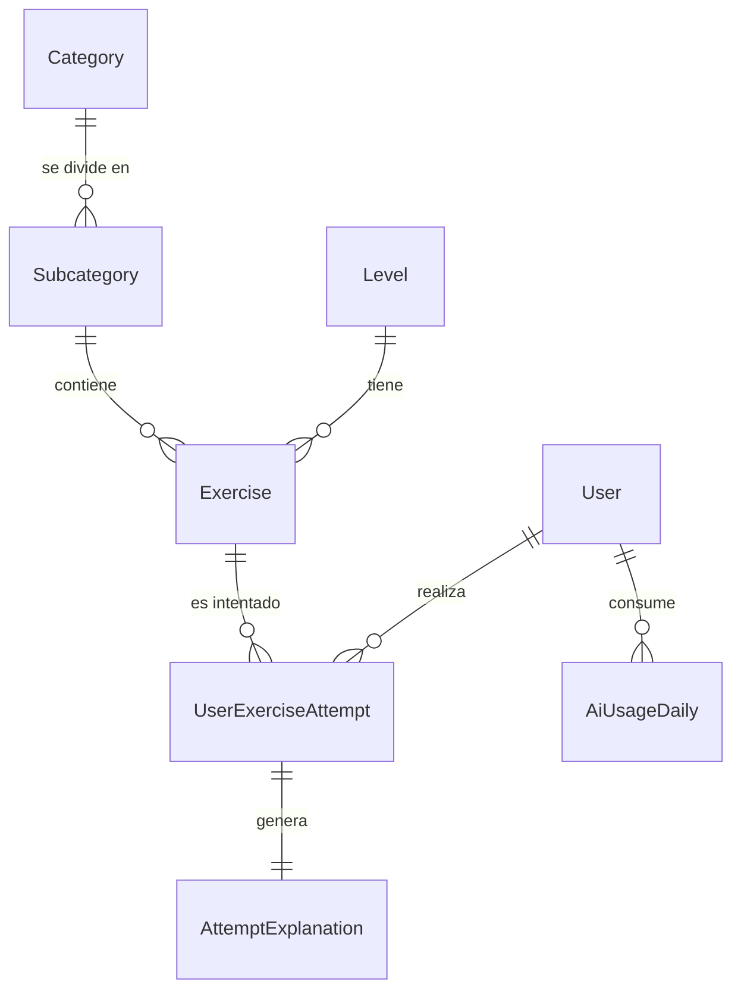

# Ceferly 🇬🇧🚀

**Ceferly** (nombre anterior: **QuickGram**) es una plataforma web para preparar titulaciones Cambridge B1 Preliminary, B2 First y C1 Advanced. El catálogo actual incluye 144 ejercicios originales de Use of English inspirados en el formato de Cambridge: 48 por nivel, 36 por parte y 12 por combinación de nivel y parte. No son ejercicios ni papers oficiales de Cambridge.

La aplicación combina práctica de inglés, seguimiento del progreso y explicaciones de respuestas mediante **Inteligencia Artificial (IA)**. Las explicaciones de intentos se guardan para poder consultarlas desde la caché.

---

## 🛠️ Arquitectura y Tecnologías

El proyecto se estructura como una aplicación monorrepositorio dividida en dos partes:

### 1. Backend (`/backend`)
*   **Servidor**: Node.js con Express (v5.2.1) en formato ESM (ES Modules).
*   **Base de Datos y ORM**: **MySQL** con **Sequelize** (v6.37.7) en tiempo de ejecución y **Prisma Migrate** para desplegar migraciones.
*   **Inteligencia Artificial**: Proveedores configurables **Google Gemini**, **OpenRouter** o **Groq** para generar explicaciones de ejercicios.
*   **Pasarela de Pago**: **Stripe** (v20.1.0) Checkout; cada compra concede 30 días de acceso `pro` o `premium`.
*   **Autenticación**: JSON Web Tokens (**JWT**) y **Google Auth Library** para login con cuentas de Google.
*   **Correos Electrónicos**: Integración con **Resend** para el envío de correos de recuperación de contraseña.

### 2. Frontend (`/frontend`)
*   **Framework**: **React 19** con **TypeScript**, compilado y servido en desarrollo con **Vite** (puerto `4200`).
*   **Estilos**: **Tailwind CSS 3** y CSS, con la identidad visual verde de Ceferly (`#58CC02`).
*   **Rutas**: `react-router-dom` (React Router v7).
*   **Animaciones**: `lottie-web` para las animaciones disponibles.
*   **Pasarela de Pago**: `@stripe/stripe-js` para las pantallas de pago.

---

## 📁 Estructura de Base de Datos y Modelos

El modelo relacional de la base de datos MySQL está definido en `/backend/src/models/` y consta de las siguientes tablas:


```mermaid
erDiagram
    User ||--o{ UserExerciseAttempt : "realiza"
    User ||--o{ AiUsageDaily : "consume"
    Level ||--o{ Exercise : "tiene"
    Category ||--o{ Subcategory : "se divide en"
    Subcategory ||--o{ Exercise : "contiene"
    Exercise ||--o{ UserExerciseAttempt : "es intentado"
    UserExerciseAttempt ||--|| AttemptExplanation : "genera"
```

### Detalle de las Tablas:
1.  **`users` (`User.js`)**: Almacena el nombre, email, contraseña con `bcrypt`, meta diaria (`daily_goal`), racha (`streak`), fecha del último intento (`last_completed_date`), monedas, corazones, semilla del avatar, ID de Google y rol/fecha de expiración del acceso (`subscription_role` y `subscription_expires_at`).
2.  **`levels` (`Level.js`)**: Niveles de inglés del Marco Común Europeo (ej. `B1`, `B2`, `C1`).
3.  **`categories` (`Category.js`)**: Categorías generales del idioma (ej. `Grammar`, `Vocabulary`, `Reading`, `Listening`, `Use of English`, `Writing`).
4.  **`subcategories` (`Subcategory.js`)**: Tipos de ejercicios específicos dentro de cada categoría (ej. `Conditionals`, `Word Formation`, `Essay`, `Gapped Text`).
5.  **`exercises` (`Exercise.js`)**: Contiene las preguntas, opciones de selección (para respuestas múltiples), el texto base (si aplica) y la estructura de respuestas correctas en formato JSON (`correct_answer`).
6.  **`user_exercise_attempts` (`UserExerciseAttempt.js`)**: Historial de intentos de ejercicios por parte de los usuarios. Almacena las respuestas proporcionadas, los aciertos, el total de huecos y la puntuación final.
7.  **`attempt_explanations` (`AttemptExplanation.js`)**: Almacena explicaciones de intentos para servirlas desde caché cuando se vuelven a consultar.
8.  **`ai_usage_daily` (`AiUsageDaily.js`)**: Lleva la cuenta de cuántas consultas a la IA realiza cada usuario al día para aplicar los límites del plan.

---

## 🚀 Funcionalidades Clave

### 1. Corrección Inteligente y Tutoría por IA
Cuando un usuario revisa un intento, puede solicitar una **explicación por IA**.
*   El backend compone un prompt con la pregunta, la respuesta del usuario, la respuesta correcta y, si existe, `explanation_rule`.
*   El prompt solicita JSON con `general_feedback` y `explanation`; el parser también acepta texto plano.
*   Si falla el proveedor, el backend puede utilizar la regla pedagógica del ejercicio como fallback.
*   **Caché**: Si el intento ya tiene una explicación en `attempt_explanations`, se sirve al instante desde la base de datos sin consumir tokens de IA.

### 2. Gamificación
*   **Meta Diaria e Hilo de Racha (Streak)**: La meta diaria se puede editar en Dashboard (5 por defecto; el control acepta enteros de 1 a 100). La racha avanza una sola vez al alcanzar la meta con intentos guardados durante el día UTC; continúa si la meta anterior se alcanzó ayer y, en otro caso, vuelve a 1. Un intento aislado por debajo de la meta no actualiza la racha.
*   **Monedas (`coins`)**: Un intento totalmente correcto concede `free`: 10, `pro`: 15 o `premium`: 20 monedas. Los intentos incorrectos o parcialmente correctos conceden 2 monedas.
*   **Tienda**: `heart-refill` restaura vidas por 30 monedas. Los paquetes de avatar cuestan 30, 50, 75 o 100 monedas y asignan una semilla de paquete (`seed-pack-*`); la compra y el saldo se procesan en el backend.

### 3. Clasificación Global (Rankings)
Permite consultar rankings globales de monedas (tipo predeterminado), ejercicios distintos completados (`mostActive`) y promedio de puntuación (`highestAverage`):
*   **Monedas**: Ordenado por monedas acumuladas y, en caso de empate, por racha.
*   **Más Activos (Most Active)**: Ordenado por el número de ejercicios únicos completados.
*   **Mejor Promedio (Highest Average)**: Ordenado por la calificación media obtenida en todos sus intentos.

### 4. Pasarela de Pagos Stripe
Ofrece dos niveles de acceso mediante compras de Stripe Checkout de tipo `payment` (no son cargos recurrentes automáticos):
*   **Plan Pro (9,99 € por compra)**: Acceso durante 30 días, hasta 15 consultas de IA al día y las prestaciones descritas por el producto Pro en el backend.
*   **Plan Premium (19,99 € por compra)**: Acceso durante 30 días y hasta 40 consultas de IA al día, junto con las prestaciones descritas por el producto Premium.
*   **Flujo**: El backend crea una sesión de Stripe Checkout. `POST /api/payments/verify-session` comprueba con Stripe que el pago se completó y concede el rol de la sesión durante 30 días.

---

## 💻 Rutas actuales del Frontend

Las rutas están definidas en `frontend/src/App.tsx` con React Router:

### Acceso y ejercicios
*   `/login`, `/register` y `/forgot-password`: inicio de sesión, registro y recuperación de contraseña.
*   `/exercises/:id`: reproductor de ejercicios.

### Aplicación
*   `/` redirige a `/learn`.
*   `/learn`: panel de aprendizaje.
*   `/categories` y `/categories/:subcategoryId/exercises`: categorías y lista de ejercicios de una subcategoría.
*   `/results`: resultados del ejercicio.
*   `/shop`: tienda.
*   `/leaderboard`: clasificación.
*   `/profile`: perfil.
*   `/payment/success` y `/payment/cancel`: resultado del flujo de pago.

---

## 🚦 Endpoints de la API Backend

La autenticación se configura en cada router; no hay un middleware JWT global ni una ruta de webhook de Stripe. En las secciones siguientes se indica la política de cada grupo: **público**, **JWT opcional** o **JWT obligatorio**. `POST /payments/verify-session` es público y el backend valida el pago consultando Stripe.

### Autenticación (rutas públicas, prefijo `/api`)
*   `POST /login` - Login clásico. Devuelve el JWT.
*   `POST /register` - Registro clásico con contraseña encriptada.
*   `POST /auth/google` - Login y registro rápido mediante Google Sign-In.
*   `POST /forgot-password` - Envía correo con token para restaurar contraseña.
*   `POST /reset-password` - Actualiza la contraseña usando el token del correo.

### Ejercicios (JWT opcional, prefijo `/api`)
*   `GET /categories` - Listado de categorías.
*   `GET /subcategories` - Listado de subcategorías.
*   `GET /exercises` - Listado de ejercicios con filtros opcionales (por ejemplo, subcategoría y nivel).
*   `GET /exercises/:id` - Trae los datos de un ejercicio específico.
*   `GET /levels` - Lista los niveles disponibles.

### Intentos (JWT obligatorio, prefijo `/api`)
*   `POST /exercises/:id/attempt` - Envía y registra un intento de ejercicio por parte del usuario, calculando y sumando las monedas y actualizando su racha diaria.
*   `GET /attempts` - Listado paginado de todos los intentos del usuario autenticado.
*   `GET /attempts/:id` - Detalle de un intento junto con la explicación de la IA si ya existe en caché.
*   `GET /attempts/stats/global` - Estadísticas del usuario: número total de intentos y porcentaje medio de acierto.

### Explicaciones con IA (según ruta, prefijo `/api`)
*   `POST /attempts/:id/explain` (**JWT obligatorio**) - Genera o devuelve desde caché la explicación del intento propio y comprueba el límite diario.
*   `POST /ai/explain` y `POST /explain` (**JWT opcional**) - Solicitan una explicación directa; la persistencia solo aplica si se envía un intento con una sesión autenticada.

### Pagos con Stripe (prefijo `/api`)
*   `POST /create-checkout-session-pro` (**JWT obligatorio**) - Crea una sesión de pago para el plan Pro.
*   `POST /create-checkout-session-premium` (**JWT obligatorio**) - Crea una sesión de pago para el plan Premium.
*   `POST /payments/verify-session` (**público**) - Verifica el estado de la sesión con Stripe y actualiza el rol del usuario asociado.

### Gestión de Usuario (JWT obligatorio, prefijo `/api`; rankings opcional)
*   `GET /users/me` - Obtiene la información del perfil completo del usuario autenticado (y revisa el estado de su racha).
*   `PUT /users/me` - Modifica el nombre o el nombre de usuario (`username`).
*   `PUT /users/me/password` - Actualiza la contraseña validando la anterior.
*   `DELETE /users/me` - Elimina permanentemente la cuenta del usuario.
*   `GET /users/me/progress` - Desglose estadístico detallado de la actividad del usuario por niveles de inglés y categorías.
*   `GET /users/me/ai-usage` - Obtiene las peticiones de IA realizadas hoy, el límite del plan y las restantes.
*   `POST /users/me/role` - Cambia manualmente el rol de suscripción (útil para pruebas locales).
*   `GET /users/me/numberOfAttemptsToday` - Obtiene el recuento de ejercicios realizados hoy y el progreso de su meta diaria.
*   `PUT /users/me/daily-goal` - Cambia la meta diaria de ejercicios del usuario.
*   `POST /users/me/shop` - Compra un paquete de avatar o recarga de vidas usando los precios del backend.
*   `POST /users/me/avatar` - Alias de compra de avatar; usa `pack-fire` por defecto (50 monedas).
*   `GET /users/rankings` (**JWT opcional**) - Clasificación global de usuarios con filtros de orden (`mostActive` o `highestAverage`) y paginación.

---

## 🚀 Puesta en Marcha Local

### Requisitos Previos
*   Node.js 22 (la versión usada por la imagen Docker del frontend).
*   Una base de datos MySQL activa.
*   Una cuenta en OpenRouter (o Groq) y Stripe (claves de prueba) si deseas probar las integraciones de IA y pagos.

### 1. Configurar el Backend
1.  Navega a la carpeta `/backend`:
    ```bash
    cd backend
    ```
2.  Instala las dependencias:
    ```bash
    npm install
    ```
3.  Crea un archivo `.env` en la raíz de la carpeta `/backend` tomando como referencia las siguientes variables:
    ```env
    ENV=TEST # TEST o PROD
    PORT_TEST=4000
    URL_TEST=http://localhost
    JWT_SECRET=tu_secreto_super_seguro_para_jwt
    
    # Base de Datos MySQL
    DB_NAME=nombre_de_tu_base_de_datos
    DB_USER=usuario_mysql
    DB_PASS=contrasena_mysql
    DB_HOST=127.0.0.1
    DB_PORT=3306 # Opcional; MySQL usa 3306 por defecto
    
    # Inteligencia Artificial
    AI_SERVER=Gemini # Gemini, OpenRouter o Groq
    GEMINI_API_KEY=tu_api_key_de_gemini
    GEMINI_MODEL=gemini-3.5-flash
    OPENROUTER_API_KEY=tu_api_key_de_openrouter
    GROQ_API_KEY=tu_api_key_de_groq
    
    # Stripe (Pasarela de pagos)
    STRIPE_SECRET_KEY_TEST=sk_test_tu_clave_secreta_de_stripe
    URL_FRONT_TEST=http://localhost:4200
    
    # Email (Resend)
    RESEND_API_KEY=re_tu_api_key_de_resend
    ```
4.  En local, al iniciar el backend se despliegan migraciones de Prisma y se ejecutan seeds automáticamente cuando `ENV=TEST` o `NODE_ENV` no es `production`. No hace falta editar `server.js`. Apunta esas ejecuciones solo a una base de datos de desarrollo/prueba; no uses `ENV=TEST` contra datos de producción. Para producción, configura `ENV=PROD` y `NODE_ENV=production`.
5.  Inicia el servidor en modo desarrollo:
    ```bash
    npm run dev
    ```

### 2. Configurar el Frontend
1.  Navega a la carpeta `/frontend`:
    ```bash
    cd ../frontend
    ```
2.  Instala las dependencias:
    ```bash
    npm install
    ```
3.  (Opcional) Configura la URL base de la API en un archivo `frontend/.env`:
    ```env
    VITE_API_BASE_URL=http://localhost:4000/api
    ```
    Si no defines esta variable, el frontend usa `http://localhost:4000/api`.
4.  Inicia el servidor de desarrollo de Vite:
    ```bash
    npm run dev
    ```
5.  Abre el navegador y accede a `http://localhost:4200/`.
